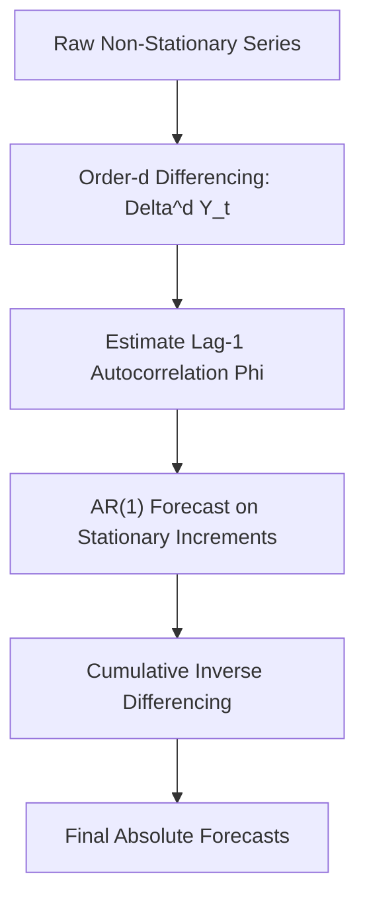

# genpark-arima-autoregressive-integrated-predictor-skill

Agent Skill implementing **ARIMA(1, d, 0) Time Series Modeling** with discrete difference transformations, autocorrelation coefficient estimation, and recursive forecasting.

## Architectural Overview

